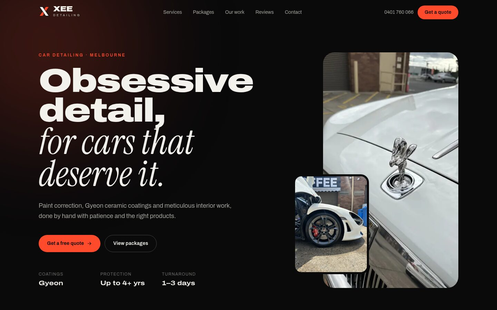

# Xee Detailing Website

The website for [Xee Detailing](https://xeedetailing.com), a Melbourne car detailing business offering paint correction, Gyeon ceramic coatings and interior detailing.



## Stack

- [SvelteKit 2](https://svelte.dev/docs/kit) with Svelte 5, fully prerendered to static HTML
- [Tailwind CSS 4](https://tailwindcss.com)
- TypeScript
- Self-hosted fonts: Archivo (variable width) and Instrument Serif
- Hosted free on Cloudflare (`@sveltejs/adapter-static`)

## Development

```sh
yarn install
yarn dev        # http://localhost:5173
yarn check      # type-check
yarn format     # prettier
yarn build      # production build into ./build
```

## Deploying to Cloudflare (free)

The site builds to plain static files in `./build`, which Cloudflare's free plan serves with no limits on bandwidth or requests.

**Option A: deploy from GitHub (recommended).** Cloudflare redeploys automatically on every push.

1. In the Cloudflare dashboard go to **Workers & Pages → Create → Import a repository** and pick this repo.
2. Set the build command to `yarn build`. The deploy command is `npx wrangler deploy`, which reads `wrangler.jsonc`.
3. Deploy, then add `xeedetailing.com` under the project's **Settings → Domains & Routes**.

**Option B: deploy from your machine.**

```sh
npx wrangler login
yarn deploy
```

Cache headers live in `static/_headers`.

## Editing content

Almost all copy lives in [`src/lib/data.ts`](src/lib/data.ts): contact details, socials, services, packages, reviews and the gallery. Edit that file and the whole site updates.

### Photos

Photos live in `static/photos/` as WebP at three sizes (`-800`, `-1600`, `-2400`). To add one, export it at those widths (longest edge), then add an entry to `photos` in `data.ts` with its real pixel widths and aspect ratio. With ImageMagick:

```sh
for w in 800 1600 2400; do
  convert input.jpg -auto-orient -strip -resize "${w}x${w}>" -quality 74 static/photos/my-photo-$w.webp
done
```

## Contact form

The form posts to [FormSubmit](https://formsubmit.co) at `xeedetailing@gmail.com` and redirects to `/thanks` afterwards. No backend is required.

## License

[MIT](LICENSE)
