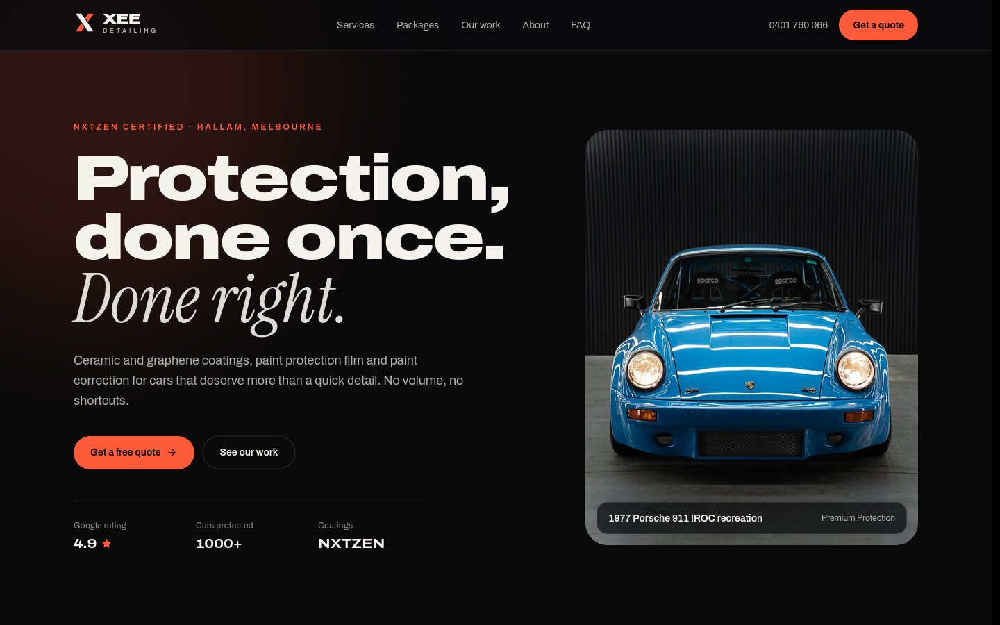
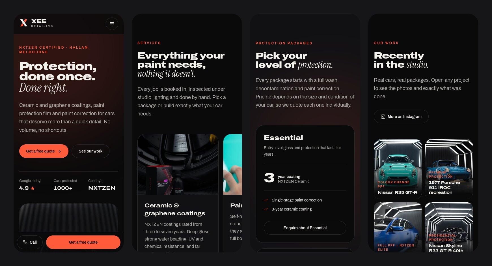
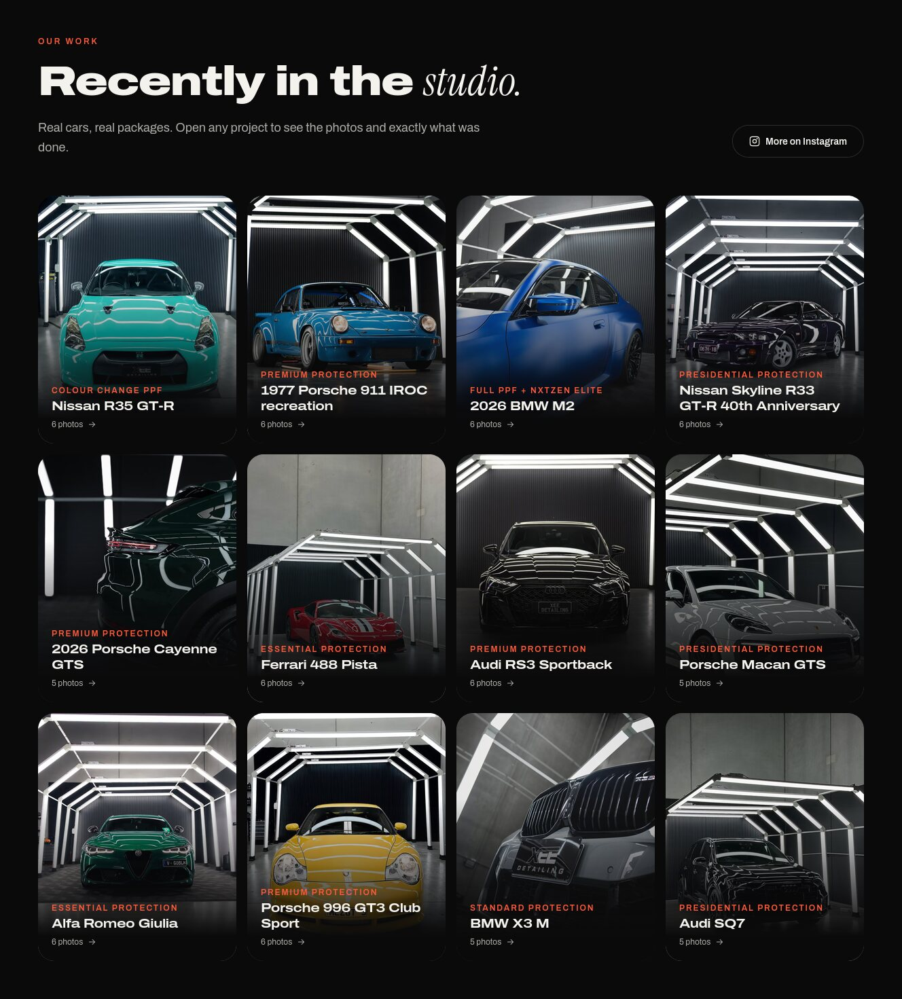

<div align="center">

# Xee Detailing

A fast, fully static website for an NXTZEN certified paint protection studio in Melbourne.

**[View the live site →](https://xee.amirnaz.com)**

Astro 7 · TypeScript · Tailwind CSS 4 · Cloudflare Workers

</div>



## Overview

[Xee Detailing](https://www.instagram.com/xeedetailing/) is a Hallam studio run by Huss Sarwari, specialising in ceramic and graphene coatings, paint protection film and paint correction, mostly on high-end and performance cars. This is a ground-up rebuild of the studio's website, designed and built to:

1. **Look as premium as the cars.** A dark, editorial design built around the studio's own light-tunnel photography.
2. **Load instantly on a phone.** Zero framework JavaScript, modern image formats and self-hosted fonts.
3. **Turn visitors into bookings.** Every section leads to the quote section, with one-tap call and WhatsApp links, and choosing a package or project pre-fills the quote form.

The site is prerendered to static HTML and served by Cloudflare's network as static assets, with no server, database or CMS. On Workers' free plan, static asset requests are free and unmetered.

## Highlights

- **About 1.4 KB of JavaScript, gzipped, on the whole page.** Astro ships HTML and CSS only. The few interactive pieces lean on the platform instead of libraries:
  - The mobile menu uses the **Popover API** (open, close, Escape and focus handling built in).
  - Project galleries are native **`<dialog>`** elements opened with **invoker commands** (`commandfor` / `command`), with a tiny fallback for older browsers.
  - Scroll reveals, the solid-on-scroll header and the mobile call-to-action bar use **CSS scroll-driven animations**, so no scroll listeners.
  - The FAQ is an exclusive `<details name>` accordion.
- **Build-time image pipeline.** Photos live in `src/assets/` as high-resolution sources. Astro's `<Picture>` generates AVIF with WebP fallbacks at multiple widths, with explicit dimensions so nothing shifts while loading. The hero image loads with high fetch priority, everything else lazily, and gallery photos load only when a project is opened.
- **Real work, real detail.** The 12-project portfolio is typed data in [`src/data/work.ts`](src/data/work.ts). Each project opens a swipeable gallery (keyboard arrows supported) with what was done to the car, taken from the studio's own write-ups.
- **Security headers and a strict CSP.** Astro hashes every inline script and style into a Content-Security-Policy `<meta>` tag at build time. The only third-party origin allowed is Cloudflare Web Analytics. [`public/_headers`](public/_headers) adds HSTS, `frame-ancestors 'none'`, a Permissions-Policy and immutable caching for hashed assets.
- **Local SEO.** schema.org `AutomotiveBusiness` structured data with address, opening hours and services, canonical URLs, Open Graph and Twitter cards with a custom share image, plus a generated sitemap and robots.txt. Everything derives from the single `site` URL in [`astro.config.ts`](astro.config.ts).
- **Self-hosted fonts.** Astro's Fonts API downloads Archivo (including its width axis for the expanded headings) and Instrument Serif at build time, serves them from the site's own domain, preloads the main face and generates metric-matched fallbacks to avoid layout shift.
- **Accessible.** Semantic landmarks, a skip link, visible focus rings, AA colour contrast, labelled icon buttons, alt text on every photo, and all motion disabled under `prefers-reduced-motion`.
- **Demo-safe quote form.** Because this deployment is a portfolio piece, the form is front-end only: it validates and confirms in place, but its fields have no names and nothing is posted, so no enquiry ever reaches the studio. Visitors are pointed to call or WhatsApp instead.

## Screenshots





## Tech stack

| Area      | Choice                                                                                                |
| --------- | ----------------------------------------------------------------------------------------------------- |
| Framework | [Astro 7](https://astro.build), static output                                                         |
| Language  | TypeScript (strictest config)                                                                         |
| Styling   | [Tailwind CSS 4](https://tailwindcss.com) through its Vite plugin, with design tokens in CSS `@theme` |
| Images    | `astro:assets` with Sharp: AVIF and WebP at build time                                                |
| Fonts     | Astro Fonts API, self-hosted Archivo and Instrument Serif                                             |
| Hosting   | Cloudflare Workers static assets, configured in [`wrangler.jsonc`](wrangler.jsonc)                    |
| Tooling   | `astro check`, Prettier (Astro and Tailwind plugins), Wrangler                                        |

There are no runtime dependencies. Everything in `package.json` is build tooling.

## Project structure

```
src/
├── assets/
│   ├── work/          # Project photos, named <project>-NN.jpg (01 is the cover)
│   ├── photos/        # Service and about photos
│   └── brands/        # Partner logos
├── components/        # One component per page section, plus Icon, Logo and SectionHeading
├── data/
│   ├── site.ts        # Business details, contact info, opening hours, navigation
│   ├── offer.ts       # Services, packages, add-ons, process, FAQs and reviews
│   └── work.ts        # Portfolio projects and their write-ups
├── layouts/Base.astro # <head>, SEO tags, fonts, header and footer
├── pages/             # index, 404, robots.txt and sitemap.xml
└── styles/global.css  # Tailwind entry, theme tokens and utilities
public/                # Favicon, share image and Cloudflare _headers
```

## Getting started

You'll need Node 22.12 or newer.

```sh
npm install
npm run dev       # http://localhost:4321
npm run check     # type-check with astro check
npm run lint      # check formatting with Prettier
npm run build     # build into ./dist
npm run preview   # serve ./dist locally on the Workers runtime
```

## Deployment

Every push to `main` deploys automatically. The repository is connected to the `xee-detailing` Worker through [Workers Builds](https://developers.cloudflare.com/workers/ci-cd/builds/), which runs `npm run build` and then `npx wrangler deploy`, with the build status shown on each commit. The Node version comes from [`.node-version`](.node-version).

The custom domain in `wrangler.jsonc` (`xee.amirnaz.com`) is created automatically, including DNS and the TLS certificate, because the zone is on the same Cloudflare account.

To deploy by hand from your machine instead:

```sh
npx wrangler login
npm run deploy
```

## Editing content

- **Text, packages and FAQs:** [`src/data/offer.ts`](src/data/offer.ts)
- **Contact details and hours:** [`src/data/site.ts`](src/data/site.ts)
- **Portfolio:** add photos as `src/assets/work/<slug>-01.jpg`, `-02.jpg` and so on, then add an entry with the same `slug` to [`src/data/work.ts`](src/data/work.ts). Around 1800px on the long edge is plenty; Astro generates every smaller size.

## License and credits

The source code is released under the [MIT License](LICENSE). The photographs, the Xee Detailing name and logo, and other brand assets belong to Xee Detailing and aren't covered by that license. Some project photos are by [@matd.media](https://www.instagram.com/matd.media/).

Designed and built by [Amir](https://amirnaz.com).
